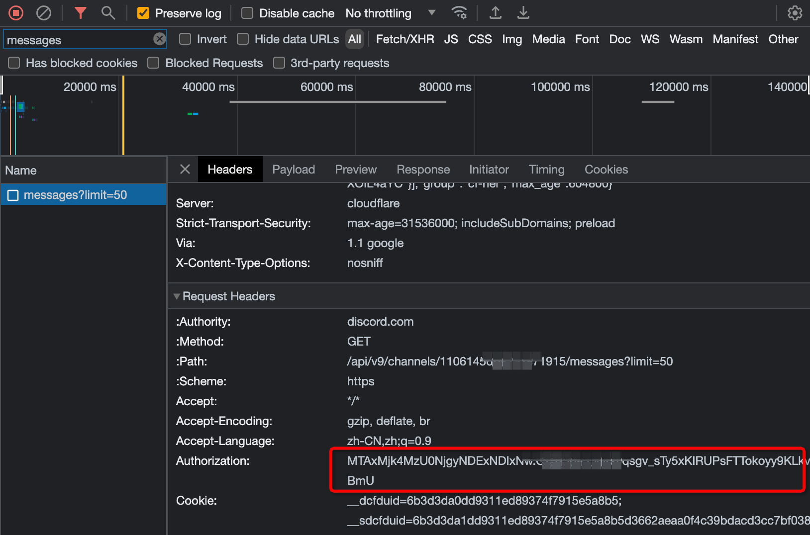
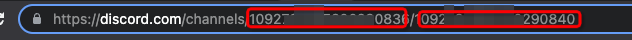
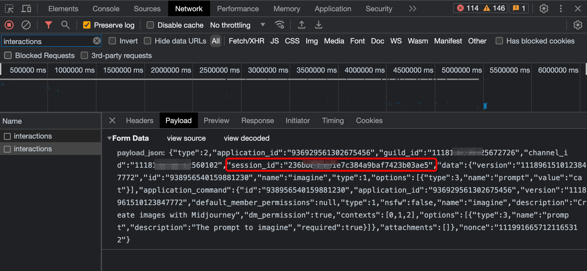

## 获取discord配置参数

### 1. 获取用户Token：user-token

方法（1）登录 Discor F12 或者 [Ctrl + Shift + I] 或者 [Command + Option + I] 打开开发者工具，然后在 Console 或者 控制台 中输入以下代码：

```javascript
  window.webpackChunkdiscord_app.push([
    [Math.random()],
    {},
    (req) => {
      for (const m of Object.keys(req.c)
        .map((x) => req.c[x].exports)
        .filter((x) => x)) {
        if (m.default && m.default.getToken !== undefined) {
          console.log("user-token：" + m.default.getToken())
          return copy(m.default.getToken());
        }
        if (m.getToken !== undefined) {
          console.log("user-token：" + m.getToken())
          return copy(m.getToken());
        }
      }
    },
  ]);
  console.log(`您的Token已经在剪贴板了!`);
  ```

方法（2）进入频道，打开 network 或者 网络，刷新页面，找到 `messages` 的请求，这里的 authorization 即用户Token，后续设置到 `user-token`



### 2. 获取服务器ID、频道ID

频道的url里取出 服务器ID、频道ID，后续设置到配置项


### 3. 获取用户sessionId

进入频道，打开network，发送/imagine作图指令，找到 `interactions` 的请求，这里的 session_id 即用户sessionId，后续设置到 `session-id`


